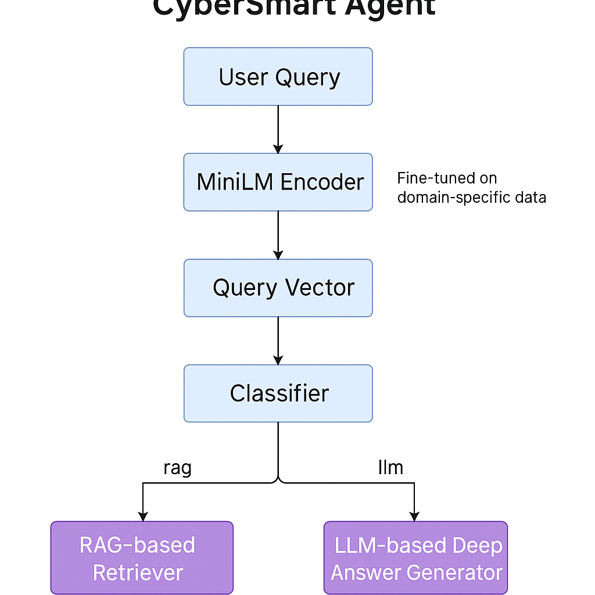
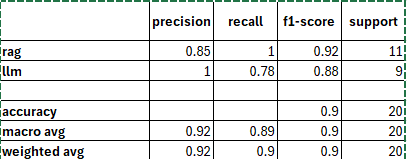

# MiniLM-RAG-router
# 🧠 CyberSmart Agent: A Modular Agentic AI for Cybersecurity Query Handling

This repository contains a smart, lightweight agentic AI application that routes cybersecurity queries intelligently using a fine-tuned **MiniLM encoder** and a custom **query classifier**. It supports both **RAG-based retrieval** and **LLM-based deep reasoning**, making it suitable for intelligent policy support, internal compliance bots, and more.

---

## 🚀 Features

- ✅ Fine-tuned `MiniLM` on cybersecurity queries
- ✅ Logistic Regression classifier for query intent classification (`rag` / `llm`)
- ✅ Smart routing logic based on query intent
- ✅ Fast inference with modular plug-and-play components
- ✅ LLM fallback for "why", "explain", "risk"-based queries
- ✅ Easy integration with Gradio or Flask frontends
---

## 🚀 Architecture 


## 🚀 Model Structure
```bash
User Query
   │
   ▼
[MiniLM Encoder]  ←←←←←←←←←←←←←←←←←←←←←
   │                                 ↑
   ▼                                 │
[Query Vector]                  Fine-tuned on
   │                           domain-specific data
   ▼
[Classifier]
   │
   ├── "rag" ──► FAISS / Chroma / RAG-based Retriever
   └── "llm" ──► fine-tuned LLaMA 3.2 / GPT-based Deep Answer Generator
```   
## 📦 Folder Structure

```bash
├── trained_encoder/           # Fine-tuned MiniLM model directory
├── query_classifier.pkl       # Trained classifier (on top of embeddings)
├── agent.py                   # Main smart agent logic
├── utils.py                   # Utility functions for vectorization, prediction
├── app.py                     # Optional: Gradio or FastAPI interface
├── requirements.txt           # All dependencies
└── README.md                  # This file

```

## 🏋️‍♂️ Training Summary
1. Fine-tuning MiniLM
Base model: sentence-transformers/all-MiniLM-L6-v2
Loss: SoftmaxLoss or CosineSimilarityLoss
Data: .jsonl file with cybersecurity query–label pairs
Framework: SentenceTransformers

2. Classifier
Features: Embeddings from fine-tuned MiniLM
Model: LogisticRegression (sklearn)
Labels: rag, llm

## 🧳 Inference Dependencies
sentence-transformers
scikit-learn
numpy
joblib
Optional: faiss-cpu, transformers, gradio, ollama

flowchart TD
    A[User Query Input] --> B[Tokenizer]
    B --> C[Embedding Lookup<br>(10 tokens → 10×384)]
    C --> D[+ Positional Embeddings]
    D --> E[MiniLM Transformer Encoder<br>(Contextualized Token Vectors)]
    E --> F[Pooling Layer<br>→ 1×384 vector]
    F --> G[Linear + Sigmoid Classifier]
    G --> H{Probability ≥ 0.5?}
    H -- Yes --> I[Route to LLM]
    H -- No --> J[Route to RAG]


## 🧳 results

